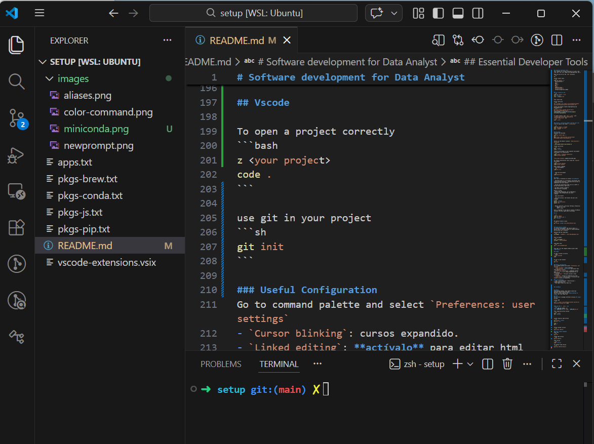
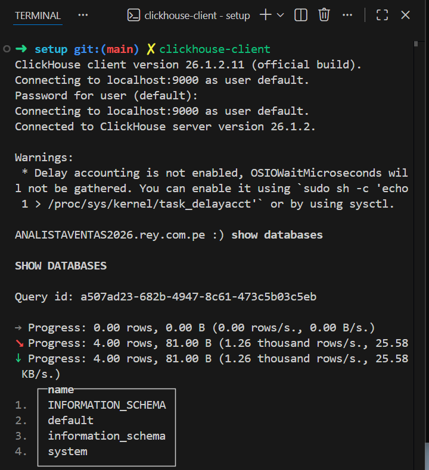

# Software development for Data Analyst
List of the steps to setup a windows machine for software development with a profile of Data Analyst. Please follow the sequence. 
If you have problems with this documentation, as a complement information ask `chatgpt` about the theme and it will guide you.

## Content

- [Architecture Analyst developer Setup](#architecture-analyst-developer-setup)
- [WSL](#wsl)
- [Essential Developer tools](#essential-developer-tools) 
- [Miniconda](#miniconda)
- [Docker](#docker)
- [Git](#git)
- [VsCode](#vscode)
- [ClickHouse](#clickhouse)
- [NodeJs](#nodejs)
- [Reference](#references)

## Architecture Analyst developer Setup
Setup linux experience
```sh
Windows 11
 ├── VS Code (installed here)
 ├── Docker Desktop (installed here)
 └── WSL2
      └── Ubuntu
           ├── Python
           ├── Conda
           ├── Git
           └── Projects (/home/<youruser>)
```

## WSL
Installing WSL2 on Windows means that you are adding a layer to your Windows computer that allows you to run Linux within Windows, without using a traditional virtual machine like VirtualBox or VMware.

In *Powershell* type this command to install WSL2, Linux kernel and Ubuntu
```sh
wsl --install
wsl --status
```

## Essential Developer Tools
This command will install practical cli tools like tree, git, ssh, zsh, themes and highlightning, and z.

Make sure you are on the `home` directory
```sh
cd ~
```
Install useful tools
```sh
sudo apt install -y \
  build-essential \
  curl \
  wget \
  unzip \
  git \
  tree \
  openssh-client \
  ca-certificates \
  software-properties-common

```
### All refered to Zsh
### Zsh installation
```sh
sudo apt install -y zsh
zsh --version
chsh -s $(which zsh)

```
Then restart WSL.

Install Oh My Zsh
```sh
sh -c "$(curl -fsSL https://raw.githubusercontent.com/ohmyzsh/ohmyzsh/master/tools/install.sh)"
``` 
Install Zsh Plugins (Syntax Highlightning and Autosuggestions)
```sh
git clone https://github.com/zsh-users/zsh-syntax-highlighting.git \
${ZSH_CUSTOM:-~/.oh-my-zsh/custom}/plugins/zsh-syntax-highlighting

```
To enable plugins, edit `nano ~/.zshrc` with `plugins=(git zsh-syntax-highlighting zsh-autosuggestions)` and 
```sh
exec ~/.zshrc
```

### Install z (Directory Jumper like Mac devs use)
A way to jump to any folder `z projectname`

```sh
sudo apt install -y zoxide
eval "$(zoxide init zsh)"
exec ~/.zshrc
```

## Miniconda
Download the Miniconda
```sh
sudo apt install wget -y
cd ~
wget https://repo.anaconda.com/miniconda/Miniconda3-latest-Linux-x86_64.sh

```
Install on the default location `/home/<youruser>/miniconda3`
```sh
./Miniconda3-latest-Linux-x86_64.sh
```
Restart and verify
```sh
exec ~/.zshrc
conda --version
```
Create an environment in your local computer with python 3.11 installation
```sh
conda create -n engineer python=3.11
conda activate engineer

```


For future installations tools use the `<environment>` environment
```sh
conda activate <environment>
conda install pyspark
```
Other usefull commands
- list environments
```sh
conda env list
```

- leave the environment
```sh
conda deactivate
```

## Docker
This tool is necessary to install **Clickhouse** 

- Download docker in this [site](https://www.docker.com/products/docker-desktop/). Download the one that is compatible with your machine.

- During the Installation make sure:

☑ Use WSL2 instead of Hyper-V

☑ Add shortcut to desktop

Reboot if asked.
- Enable WSL Integration, go to *Settings → Resources → WSL Integration* and check 

☑ Ubuntu

- Apply and restart

- Check the version, test docker and your info settings
```sh
docker --version
docker run hello-world
docker info
```

- Adjust resources in the app: Settings → Resources: 
    - Memory: 6 - 8 GB
    - CPU: 4 cores

This is important if you plan to install ClickHouse, Postgres, Airflow, Spark and ML workloads

## Git
Installation
```sh
sudo apt update
sudo apt install git -y
git --version

```
Set default branch to main
```sh
git config --global init.defaultBranch main

```

### Setup SSH for GitHub
In software development, SSH (Secure Shell) is mainly used to securely connect to remote machines and services over a network.

Generate SSH key inside `~/.ssh`:
```sh
ssh-keygen -t ed25519_personal -C "your-email@example.com"
```

Start ssh agent:
```sh
eval "$(ssh-agent -s)"
ssh-add ~/.ssh/id_ed25519_personal
```

Copy public key with `cat` command and add it to the company GitHub account under **SSH keys**.
```sh
cat ~/.ssh/id_ed25519_personal.pub
```

### Senior Configuration
To manage github accounts simultaneusly: work and personal

- Edit
```sh
nano ~/.gitconfig
```
- Add
```sh
# Work GitHub
[user]
    name = Carlos Leon

[includeIf "gitdir:/home/cleon/rey/projects/"]
    path = /home/cleon/.gitconfig-work

[includeIf "gitdir:/home/cleon/personal/projects/"]
    path = /home/cleon/.gitconfig-personal

[init]
        defaultBranch = main

```
- Edit
```sh
nano ~/.gitconfig-work
 
```
- Add
```sh
[user]
    email = calobeto.leon@gmail.com
[core]
    sshCommand = ssh -i ~/.ssh/id_ed25519_personal
```
> [!IMPORTANT]
> While i was documenting this setup project, i haven't received github credentials. So i completed it with my personal account. Change it later!

- Permissions
```sh
mkdir -p ~/rey
mkdir -p ~/personal
```
- Add public keys to Github

Store the results in GitHub Enterprise → Settings → SSH Keys
```sh
cat ~/.ssh/id_ed25519_work.pub
``` 

Store in GitHub Personal → Settings → SSH Keys

```sh
cat ~/.ssh/id_ed25519_personal.pub
```

#### Quick checks with `tree ~/.ssh` command
```sh
/home/cleon/.ssh
├── config
├── id_ed25519_personal
├── id_ed25519_personal.pub
├── id_ed25519_work
└── id_ed25519_work.pub
```

## Vscode

### Installation
- Download [vscode](https://code.visualstudio.com/) and install it.

During installation, enable:

✅ “Add to PATH”

✅ “Register Code as an editor”

✅ “Add Open with Code”

- Go to Extensions (Ctrl + Shift + X) and install **Remote - WSL**

### Install Recommended Extensions (For You)

🔹 Development
    - Python
    - Docker
    - GitLens
    - YAML

🔹 Data
    - SQLTools
    - ClickHouse extension
    - Jupyter

🔹 Optional (for interviews)
    - Prettier
    - ESLint
    - Conventional Commits
    - Jinja

To open a project correctly with vscode, if you are on root directory (`~`)
```bash
z <your project>
code .
```

To use git in your project and check the prompt.
```sh
git init
```


### More Custom Configuration
Go to command palette and select `Preferences: user settings` 
- `Cursor blinking`: cursos expandido.
- `Linked editing`: **actívalo** para editar html tags apertura y cierre.
- `bracket pair colorization`: establece colores para `()` y `{}` en tu código dependiendo de la profundidad.
- `brackets pair`: true para colorear líneas verticales.
- `breadcrums`: elimina el breadcrum de arriba.
- `sticky scroll`: fija una guía y te avisa en que función o archivo te encuentras.

### List extensions
- code --list-extensions --show-versions > vscode-extensions.vsix
- Then import them as an VSIX file

## ClickHouse
- Start **docker**, remember you have already installed [see again here](#docker).
- Execute this command
```sh
clickhouse-client
```
- In the Clickhouse client prompt test with: `show databases`



## NodeJs
Node package manager (npm) handle javascript packages inside a Node project.
This is crucial when you use **ObservableHq** a visual tool like *Power BI*

### NVM
It is a tool to manager different versions of **npm** packages. 

Install NVM
```sh
curl -o- https://raw.githubusercontent.com/nvm-sh/nvm/v0.39.7/install.sh | bash

```
#### Add NVM to `.zshrc` file
```sh
export NVM_DIR="$HOME/.nvm"
[ -s "$NVM_DIR/nvm.sh" ] && \. "$NVM_DIR/nvm.sh"
```
Then reload and verify version 
```sh
exec ~/.zshrc
nvm --version

```

Install specific node version
```sh
nvm install --latest
nvm use --lts

node -v
npm -v

```
Install another version
```sh
nvm install 20.9.0
```
### Other Common Commands
node list
```sh
nvm list
```
change node version
```sh
nvm use 20.9.0
```
node version
```sh
node --version
```
set default node version
```sh
nvm alias 20.9.0 default
```

## References
- [¡Necesitas cambiar estas configuraciones de Visual Studio Code!](https://www.youtube.com/watch?v=uyEUVgNMvGI)


