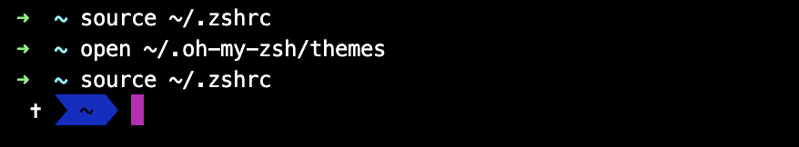
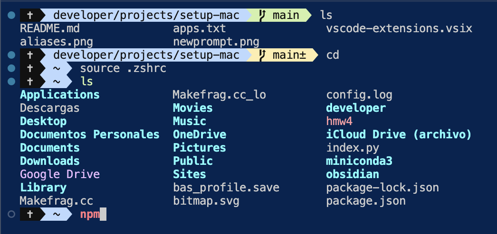

# About the project
List of the steps for setup windows for software development 

## Software development for Data Analyst
Follow installation the sequence
1. wls2
2. Miniconda (by default it comes with Python)
3. Docker (optional)
4. Essential Developer tools (zsh, z, tree, ssh, themes and highlightning)
5. VsCode
6. NodeJs (install it with Fnm -see in Configurations)


## Global configuration
`.*` files are for global configuration and they are located in **home directory**. `.zprofile`, `.zshrc` are some of these kind of files.

Go to home directory
```sh
z ~
```

## Software setup
### VScode 
#### Initial
Go to the palette and choose `Install 'code' command in PATH`. 

Use as a shortcut to your projects
```sh
code .
``` 
#### Configurations
Go to command palette and select `Preferences: user settings` 
- `Cursor blinking`: cursos expandido.
- `Linked editing`: **actívalo** para editar html tags apertura y cierre.
- `bracket pair colorization`: establece colores para `()` y `{}` en tu código dependiendo de la profundidad.
- `brackets pair`: true para colorear líneas verticales.
- `breadcrums`: elimina el breadcrum de arriba.
- `sticky scroll`: fija una guía y te avisa en que función o archivo te encuentras.

#### List extensions
- code --list-extensions --show-versions > vscode-extensions.vsix
- Then import them as an VSIX file

### fnm
install last node
```sh
fnm install --latest
```
install specific node
```sh
fnm install 20.9.0
```
node list
```sh
fnm list
```
change node version
```sh
fnm use 20.9.0
```
node version
```sh
node --version
```
set default node version
```sh
fnm alias 20.9.0 default
```

### Python with miniconda
Use miniconda environment for every python installation. If you install pytorch, create a new environment too.

Create environment
```sh
conda create --name py310
```
activate environment
```sh
conda activate py310
```
list environments
```sh
conda env list
```
install python
```sh
conda install python=3.10
```
check installation
```sh
python --version
```
leave the environment
```sh
conda deactivate
```

## List of mac apps 
Go to finder in `Aplicaciones` and saved in `apps.txt` or
```
pkgutil --pkgs /Applications | grep -v '^com\.apple\.pkg' > apps.txt
```

## List of packages
python: pip
```sh
pip list > pip-pkgs.txt
```

js 
```sh
npm list -g --depth=0 --json > js-packages.txt
```

brew (check the used ones)
```sh
brew list --versions | grep -v ^lib > brew-packages.txt
```

conda
```sh
conda env export --from-history > conda-pkgs.txt
```

## New Terminal
### Terminal installation
Install *hyper.js* which replace your default terminal with an styled terminal and ohmyz to styled the prompt.

- Go to [My zsh](https://ohmyz.sh/) and install, don't forget to re install your hyper terminal.
- Go to [powerline/fonts](https://github.com/powerline/fonts), download the repository and add the folder *Mesio Dotted* to your mac fonts book.
- Go to hyper/preferences and add the font

 Now style the prompt
 - Go to [cobalt2-iterm](https://github.com/wesbos/Cobalt2-iterm) and download the theme.
 - Move the theme to zshrc directory
 ```sh
 open ~/.oh-my-zsh/themes
 ```
- Open .zshrc and modify ZSH_THEME="cobalt2". It will display


- Go to [ohmyzsh](https://github.com/ohmyzsh/ohmyzsh/wiki)
to see the alias. Test it


- If you migrate from bash to zsh, Add the following to your .zshrc profile:
```zsh
eval "$(fnm env --use-on-cd --shell zsh)"
```

### Zsh Syntax Highlightting
Hightlights what you type in terminal
- Go to [zsh-syntax-highlighting](https://github.com/zsh-users/zsh-syntax-highlighting?tab=readme-ov-file) and look at INSTALL.md 
- Because you have already install oh-my-zsh you only need to clone and activate the plugin in `~/.zshrc`. Restart zsh.


## References
- [Tools](https://whitep4nth3r.com/blog/everything-i-install-and-set-up-on-a-new-macbook-as-a-web-developer/)

- [Setting up new Mac](https://www.youtube.com/watch?v=mmkDyV59nRo&t=250s)

- [¡Necesitas cambiar estas configuraciones de Visual Studio Code!](https://www.youtube.com/watch?v=uyEUVgNMvGI)


